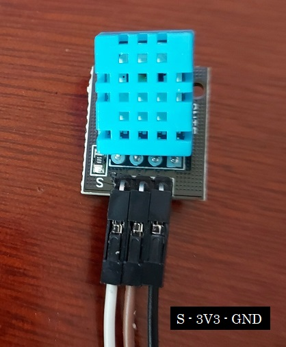

# Outgoing

ESP32 wifi module that takes data from a sensor and sends it to a server in Golang for multithread API handling.

## Libraries

1. Visit https://docs.espressif.com/projects/arduino-esp32/en/latest/installing.html for ESP32 library to download from the official repo (https://github.com/espressif/arduino-esp32.git) to your machine's Arduino IDE include libraries.

2. Once you clone the repo into the target directory (usually, C:/Users/YOUR_USERNAME/Documents/Arduino), go to `hardware/expressif/esp32/tools` and doblue click `get.exe`. When the file finishes a few downloads, it will close itself.

## Drivers

1. Look at the ESP32 module to see which chip it has. For example, mine has written "SILABS CP2102":


This means we need to use the Silicon Labs CP2102 USB-to-UART Bridge Controller driver ("cp2102 driver in google") provide USB connectivity while communicating via a simple serial protocol, which basically allows the PC to recognize the module and communicate with it through a USB cable.

- To install it, go to https://www.silabs.com/developers/usb-to-uart-bridge-vcp-drivers and click on `CP210x Universal Windows Driver` option to download a zip file.

- Unzip the file to a temporary folder, right click on the file `silabser.inf` and choose Install. This is all you need to do.

2. Connect the module through a micro-USB cable.

3. Open the Arduino IDE.

4. Go to `Tools > Board` and look at the following:


- We choose `ESP32 Dev Module` option because the ESP32 module we have, on the back, it reads "ESP32 DEVKITV1", as seen below.


5. Click on Load to the code below to see if the computer is able to communicate with the module:

```c++
// this will make the board blink
void setup() {
  // put your setup code here, to run once:
  pinMode(2, OUTPUT);
}

void loop() {
  // put your main code here, to run repeatedly:
  digitalWrite(2, HIGH);
  delay(1000);
  digitalWrite(2, LOW);
  delay(1000);
}
```

*If everything is ok, a led will start blinking in the ESP32 module.*

## Send Sensor Data To Serial Monitor

1. We will use a DHT11 sensor to get the temperature and display it on the serial monitor first.

2. Wire the sensor to the ESP32 module using female-female dupont cables. The DHT11 sensor looks like this:



*Note: in the sensor, the "S" marks the spot where signal (3V3) should go, and it can change depending on the DHT11 sensor you have.*

The ESP32 module looks like below.


3. To make the code more readable, we handle the DHT11 data with a built-in Arduino Library called "DHT sensor library", which you need to include in your project. To do that, go to `Sketch > Include Library > Manage Libraries`, which will open a Library Manager.


4. In the Library Manager's search field, type "dht" and look for "DHT sensor library". Click on Install.


5. Now, load the following code to the ESP32:

```c++
// code that prints temperature on serial monitor
#include "DHT.h"
#define DHTPIN 2
#define DHTTYPE DHT11
DHT dht(DHTPIN, DHTTYPE);

void setup() {
  // put your setup code here, to run once:
  Serial.begin(9600);
  Serial.println("DHT11 output:");
  dht.begin();
}

void loop() {
  // put your main code here, to run repeatedly:
  float temp = dht.readTemperature();
  if (isnan(temp)) {
    Serial.println("No data");
  }else{
    Serial.print("Temperature: ");
    Serial.print(temp);
    Serial.println("°C");
    delay(1000);
  }
  
}
```

And you will see the output in the Serial Monitor (9600):

